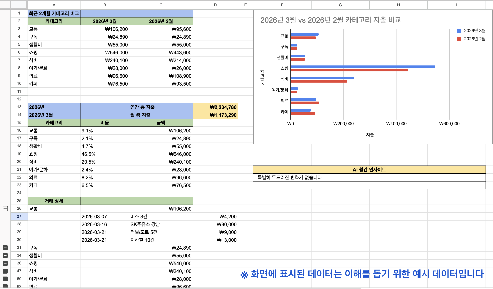

# Personal Budget Tracker



## Setup

### 1. Google Sheets 준비

1. [Google Cloud Console](https://console.cloud.google.com)에서 프로젝트 생성
2. Google Sheets API 활성화
3. Service Account 생성 → JSON 키 다운로드 → `credentials.json`으로 저장
4. Google Sheets에서 새 스프레드시트 생성
5. 스프레드시트 URL의 ID 복사 (`.../spreadsheets/d/<ID>/edit`)
6. 스프레드시트 공유 → service account 이메일에 편집자 권한 부여

### 2. 환경 변수 설정

`.env` 파일을 만들거나 셸에서 직접 export 합니다.

`.env` 예시:

```bash
export SPREADSHEET_ID="your-spreadsheet-id"
export GOOGLE_CREDENTIALS="credentials.json"  # default
export OPENAI_API_KEY="your-openai-api-key"   # optional, dashboard AI insights
export OPENAI_MODEL="gpt-5"                  # optional
export OPENAI_WEB_SEARCH="true"              # optional, lets AI tips search the web
```

셸에서 직접 설정할 수도 있습니다.

```bash
export SPREADSHEET_ID="your-spreadsheet-id"
export GOOGLE_CREDENTIALS="credentials.json"  # default
export OPENAI_API_KEY="your-openai-api-key"   # optional, dashboard AI insights
export OPENAI_MODEL="gpt-5"                  # optional
export OPENAI_WEB_SEARCH="true"              # optional, lets AI tips search the web
```

### 3. 의존성 설치

```bash
pip install -r requirements.txt
```

## 사용법

`expense/` 폴더에 내보낸 파일을 넣고 실행합니다.

```bash
# expense/ 폴더의 모든 파일 자동 인식
python import_cmd.py

# 파일 직접 지정
python import_cmd.py --files kb_card_may.xls kb_bank_may.xls

# 소스 직접 지정
python import_cmd.py --files statement.xls --source kb
```

원본 지출 파일은 수정하지 않습니다. 가져온 파일은 `imported_files.json`에 파일명,
파일 해시, 가져온 시각, 행 수, 소스를 기록해 변경 없는 파일은 다음 실행에서 건너뜁니다.
그래도 중복 방지는 파일 단위가 아니라 거래 단위 `transaction_id`로 한 번 더 수행합니다.

`transactions` 시트는 정규화된 작업 테이블입니다. 각 거래는 `source`, `date`,
원본 가맹점명, 금액, 승인번호(파서가 제공하는 경우)를 기반으로 생성한 안정적인
`transaction_id`를 갖습니다. `dashboard`는 언제든 다시 만들 수 있는 파생 뷰입니다.

## 지원 파일 형식

국민카드·국민은행 앱에서 내보낸 `.xls` 파일을 그대로 사용합니다.

| 소스 | 파일명 패턴 | 비고 |
|------|------------|------|
| 국민카드 | `*카드*.xls` | 국내이용금액=0 (해외결제) 자동 제외 |
| 국민은행 계좌 | `*은행*.xls` / `*bank*.xls` | 출금 내역만 가져옴, KB카드 자동이체 제외 |

파서 파일 상단의 `*_COL` 상수를 수정하면 컬럼명을 커스텀할 수 있습니다.

- `parsers/kb_card.py` → `DATE_COL`, `MERCHANT_COL`, `AMOUNT_COL`
- `parsers/kb_bank.py` → `DATE_COL`, `MERCHANT_COL`, `AMOUNT_COL`

## 카테고리 분류 방식

CLI 프롬프트 없이 Google Sheets에서 직접 관리합니다.

1. **첫 실행 시** `categories` 시트에 기본 카테고리 목록이 자동 생성됩니다  
   (식비, 카페, 쇼핑, 교통, 의료, 생활비, 여가/문화, 구독, 기타)

2. **미등록 가맹점**은 `merchant_categories` 시트에 빈 카테고리로 추가되고,  
   해당 거래는 transactions 시트에 `미분류`로 기록됩니다.

3. **Sheets에서 카테고리 입력**: `merchant_categories` 시트의 B열 드롭다운에서  
   카테고리를 선택하거나 직접 입력합니다.

4. **다음 실행 시** 기존 거래의 카테고리가 `merchant_categories` 기준으로 동기화됩니다.  
   이미 분류된 거래도 가맹점 매핑을 바꾸면 새 카테고리로 업데이트됩니다.

## 대시보드

매 실행마다 `dashboard` 시트가 자동 재생성됩니다.  
연간 총 지출, 월별 총 지출, 월별 카테고리 비율과 금액을 보여줍니다.  
상단에는 최근 2개월의 카테고리별 지출을 비교하는 막대 차트가 생성됩니다.  
`OPENAI_API_KEY`가 설정되어 있으면 최근 2개월의 의미 있는 변화와 구체적인 대응 팁을
`AI 월간 인사이트` 섹션에 생성합니다. API 키가 없거나 호출에 실패해도 계산된 변화 요약으로
대시보드는 계속 생성됩니다.  
`OPENAI_WEB_SEARCH=true`를 추가하면 LLM이 현재 가격, 멤버십, 대체 서비스처럼 최신 정보가
필요한 팁에 한해 웹 검색을 사용할 수 있습니다. 웹 검색은 추가 비용과 실행 시간을 늘릴 수 있습니다.  
각 카테고리 행을 펼치면 세부 거래 내역을 확인할 수 있습니다.  
카테고리 그룹은 기본적으로 접힌 상태로 표시됩니다.

## Google Sheets 자동화

`merchant_categories` 시트에서 카테고리를 바꿨을 때 Python을 다시 실행하지 않고
`transactions`와 `dashboard`를 즉시 갱신하려면 Apps Script 자동화를 설치할 수 있습니다.

설치 방법은 `docs/apps-script-automation.md`를 참고하세요.

Python은 여전히 은행/카드 파일 가져오기를 담당하고, Apps Script는 가져온 뒤의
시트 편집 반영과 대시보드 재생성을 담당합니다.
